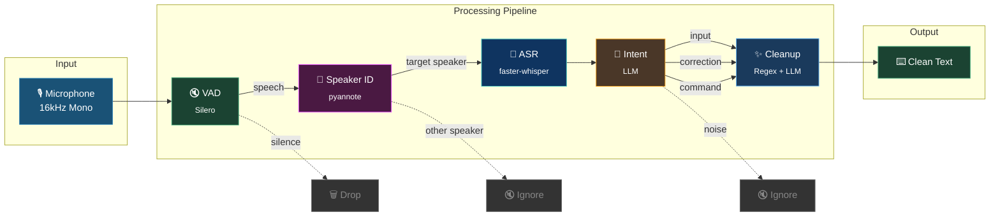
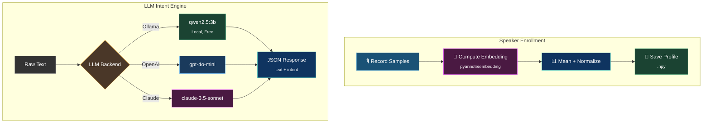

<p align="center">
  
  
  
  
</p>

<h1 align="center">Smart Voice Input</h1>

<p align="center">
  <strong>An intelligent, speaker-aware voice input system for macOS — powered by Whisper, pyannote, and LLM-based intent understanding.</strong>
</p>

<p align="center">
  Real-time speech recognition that knows <em>who</em> is speaking, <em>what</em> they mean, and outputs only clean, intended text.
</p>

---

## Highlights

- **Speaker Identification** — Enroll your voice once; the system ignores everyone else in the room
- **LLM-Powered Intent Understanding** — Distinguishes dictation from corrections, commands, and background noise
- **Filler Word Removal** — Automatically strips "嗯", "那个", "um", "like" and other verbal fillers
- **Voice Commands** — Say "换行" or "period" to insert punctuation and formatting naturally
- **Self-Correction Handling** — Say "不对" or "wrong" and the system understands you're correcting previous input
- **Multi-Backend LLM** — Supports Ollama (local), OpenAI, and Claude as the intent/cleanup engine
- **Chinese + English** — Full bilingual support with mixed-language handling
- **Apple Silicon Optimized** — Runs efficiently on M-series chips with MPS acceleration

## Architecture





| Stage | Technology | Purpose |
|-------|-----------|---------|
| Audio Capture | `sounddevice` | Real-time 16kHz mono PCM streaming |
| Voice Activity Detection | Silero VAD | Filter silence, reduce compute waste |
| Speaker Identification | pyannote/embedding | Cosine similarity against enrolled profiles |
| Speech-to-Text | faster-whisper (CTranslate2) | Low-latency transcription on CPU/MPS |
| Intent Classification | Rule-based + LLM | Categorize: input / correction / command / noise |
| Text Cleanup | Regex + LLM | Remove fillers, normalize, apply corrections |

## Quick Start

### Prerequisites

- macOS 12+ (Apple Silicon recommended)
- Python 3.10+
- ffmpeg (`brew install ffmpeg`)
- HuggingFace account with pyannote model access

### Installation

```bash
git clone https://github.com/BambooGarden/voiceInput.git
cd voiceInput
python -m venv .venv
source .venv/bin/activate
pip install -e ".[dev]"
```

### Run the Web Demo

```bash
# Start with local Ollama (recommended for privacy)
ollama pull qwen2.5:3b
python scripts/web_server.py
```

Open http://localhost:8000 — press and hold the button to record, release to process.

### Run in Terminal (Streaming Mode)

```bash
python scripts/run_demo.py
```

## Speaker Enrollment

Register your voice so the system only responds to you:

```bash
python scripts/enroll_speaker.py --name "your_name" --samples 5
```

The system records multiple voice samples, computes a mean embedding, and saves it as your speaker profile. During inference, audio from non-enrolled speakers is classified as `NOISE` and filtered out.

## LLM Configuration

The system auto-detects available LLM backends in this priority:

| Priority | Backend | Model | Setup |
|----------|---------|-------|-------|
| 1 | Ollama (local) | `qwen2.5:3b` | `ollama pull qwen2.5:3b` |
| 2 | OpenAI | `gpt-4o-mini` | Set `OPENAI_API_KEY` |
| 3 | Claude | `claude-3-5-sonnet` | Set `ANTHROPIC_API_KEY` |

Override with environment variable: `LLM_MODEL=your-model-name`

## Project Structure

```
voiceInput/
├── src/voice_input/
│   ├── pipeline.py          # Main orchestrator
│   ├── config.py            # Dataclass configuration
│   ├── audio/
│   │   ├── capture.py       # Microphone streaming
│   │   ├── vad.py           # Silero VAD integration
│   │   └── processor.py     # Normalization & resampling
│   ├── speaker/
│   │   ├── identify.py      # Speaker verification
│   │   ├── enroll.py        # Voice profile enrollment
│   │   └── diarize.py       # Multi-speaker diarization
│   ├── asr/
│   │   └── whisper.py       # faster-whisper STT
│   ├── intent/
│   │   └── classifier.py    # Intent categorization
│   ├── cleaner/
│   │   └── text_cleaner.py  # Filler removal & normalization
│   └── llm/
│       └── processor.py     # LLM-based understanding
├── scripts/
│   ├── web_server.py        # FastAPI web demo
│   ├── run_demo.py          # Terminal streaming demo
│   ├── enroll_speaker.py    # Speaker enrollment CLI
│   └── quick_test.py        # Quick component test
├── web/
│   └── index.html           # Browser-based recording UI
└── tests/
    └── test_pipeline.py     # Pipeline integration tests
```

## How Intent Classification Works

The system categorizes every utterance into one of four intents:

| Intent | Example | Behavior |
|--------|---------|----------|
| `INPUT` | "今天天气真不错" | Clean and output as typed text |
| `CORRECTION` | "不对，应该是明天" | Replace previous input with corrected version |
| `COMMAND` | "换行" / "period" | Output corresponding symbol (`\n`, `.`) |
| `NOISE` | Background conversation | Silently ignored |

The LLM adds a deeper layer: it understands self-corrections mid-sentence ("我想去...不对，我想吃火锅") and extracts only the final intended text.

## Roadmap

### v0.2 — System Integration
- [ ] macOS global keyboard shortcut activation (e.g., hold `Fn` to dictate)
- [ ] Direct text injection via `CGEventCreateKeyboardEvent` — type into any app
- [ ] Menu bar status indicator with waveform visualization
- [ ] Low-latency mode with streaming ASR (partial results while speaking)

### v0.3 — Intelligence
- [ ] Context-aware dictation (adapt vocabulary to active app: code vs. prose vs. chat)
- [ ] Custom vocabulary and domain-specific terms
- [ ] Multi-turn correction ("delete the last sentence", "change that to...")
- [ ] Adaptive speaker model — profile improves over time with use

### v0.4 — Performance & Polish
- [ ] CoreML Whisper model for native Apple Neural Engine acceleration
- [ ] Sub-200ms end-to-end latency target
- [ ] Offline mode with quantized on-device LLM
- [ ] Energy-efficient always-listening with hardware VAD

### v0.5 — Ecosystem
- [ ] Plugin system for custom commands ("open Safari", "send message to...")
- [ ] Multi-language hot-switching without explicit language selection
- [ ] Accessibility integration (VoiceOver coordination)
- [ ] iOS companion app with Handoff support

## Technical Specifications

| Parameter | Value |
|-----------|-------|
| Audio Format | 16kHz, mono, float32 |
| VAD | Silero VAD v5, 512-sample chunks |
| ASR Engine | faster-whisper (CTranslate2) |
| Speaker Embedding | pyannote/embedding, 512-dim |
| Similarity Metric | Cosine similarity, threshold 0.65 |
| Supported Languages | Chinese (zh), English (en), mixed |
| Min Speech Duration | 250ms |
| Silence Timeout | 800ms |

## License

MIT

---

<p align="center">
  <sub>Built with late-night coffee and questionable life decisions on Apple Silicon.</sub>
</p>
